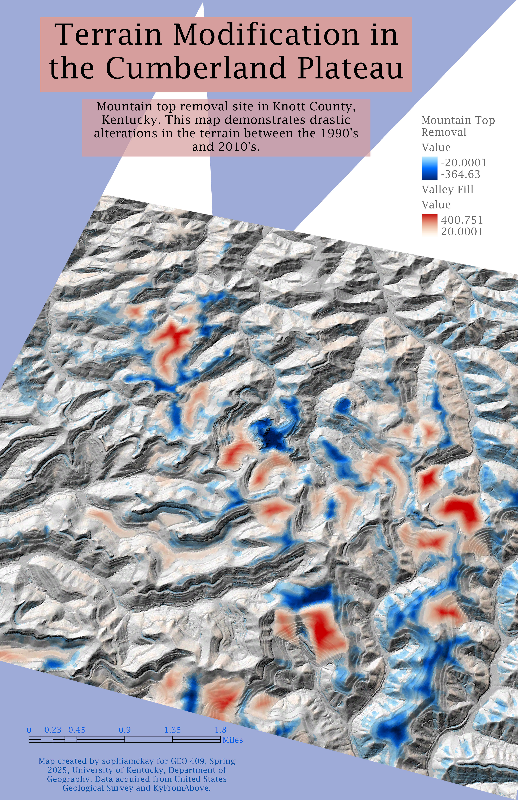

# Cumberland Plateau Terrain Modification

## Mountain top removal site in Knott County, Kentucky.

This map demonstrates the mass terrain modifications that occured in Knott County due to mountain top removal mining. Areas in dark blue represent a loss of vegetation while areas highlighted in red represent valley infill.

  
_Terrain Alterations in the Cumberland Plateau from 1990 to 2010_

[Link to high-resolution version of terrain modification](hi-res.pdf)

Map created by sophiamckay for GEO 409, Spring 2025, University of Kentucky, Department of Geography. Data acquired from the _United States Geological Survey_ and _KyFromAbove_.